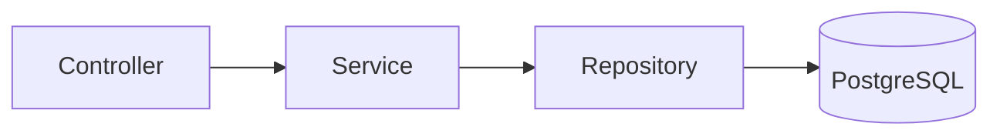
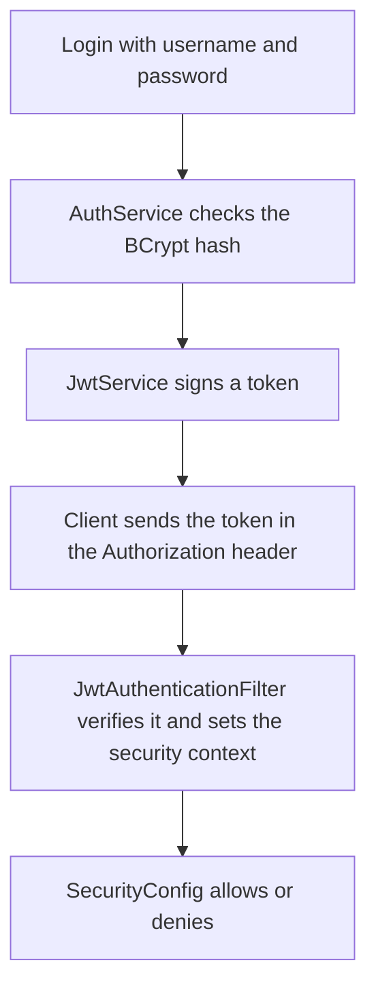
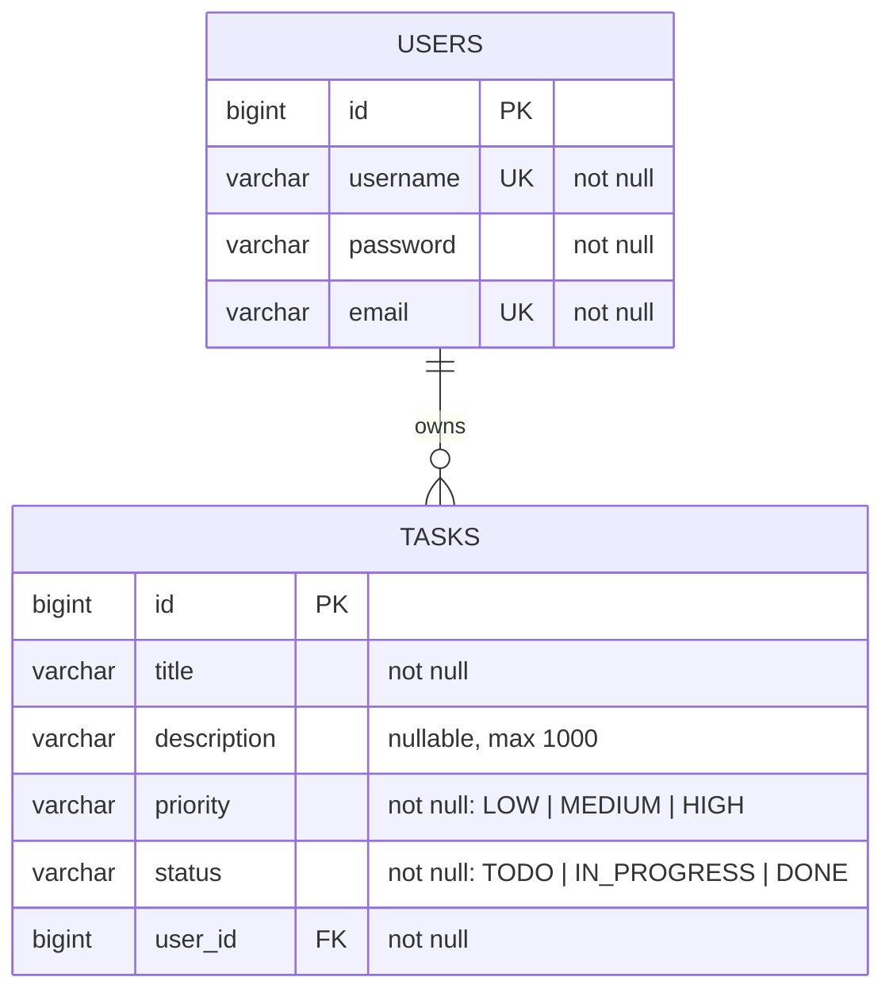

# Full-Stack Task Management Application

A task management REST API with an Angular frontend. Users register, log in, and
manage their own tasks. Each task has a status and a priority. Users only see and
manage tasks they own.

## Tech Stack

**Backend:** Java 26, Spring Boot 4.1.0, Spring Security 7 (JWT), Spring Data
JPA / Hibernate, PostgreSQL 17, Maven

**Frontend:** Angular 22, TypeScript, Bootstrap 5.3.8

**Testing and tooling:** Cucumber 7.34.4, H2, Docker Compose, GitHub Actions

## Setup

Requires Docker, Docker Compose, and Node.js 22+ with the Angular CLI.

### 1. Environment variables

Copy `.env.example` to `.env` in the project root and fill in the values:

```
POSTGRES_DB=taskdb
POSTGRES_USER=your_user
POSTGRES_PASSWORD=your_password
JWT_SECRET=generate_with_openssl_rand_base64_32
JWT_EXPIRATION_MS=3600000
```

Generate the JWT secret with `openssl rand -base64 32`.

### 2. Backend and database

```bash
docker compose up -d --build
```

API available at `http://localhost:8080`.

### 3. Frontend

```bash
cd frontend
npm install
ng serve
```

Available at `http://localhost:4200`. The frontend is not containerized.

### Running the backend outside Docker

```bash
docker compose up -d db
cd backend
set -a; source ../.env; set +a
./mvnw spring-boot:run
```

## Architecture



**Controller:** handles HTTP. Unpacks the request, calls the service, sets the
status code.

**Service:** application logic. Uniqueness checks, password hashing, ownership
rules, token creation.

**Repository:** data access. Spring Data JPA generates the implementations from
the interfaces.

**Entity:** mapped to database tables by JPA.

Requests and responses use DTOs. Entities never cross the API boundary.

Ownership is enforced at the query level: `findByIdAndUserId` returns nothing for
another user's task, so the request results in a 404.

### Packages

```
com.oie.taskmanagement
├── config       SecurityConfig (filter chain, CORS, password encoder)
├── controller   AuthController, TaskController
├── dto          request and response records
├── entity       User, Task, TaskStatus, TaskPriority
├── exception    custom exceptions and the global handler
├── repository   UserRepository, TaskRepository
├── security     JwtService, JwtAuthenticationFilter
└── service      AuthService, TaskService
```

### Authentication

Stateless, with no server-side sessions.



An invalid or missing token leaves the security context empty. `SecurityConfig`
then denies the request unless the endpoint is public.

## Database



Status and priority are stored as strings with `@Enumerated(EnumType.STRING)`.

## API

| Method | Endpoint | Description |
|--------|----------|-------------|
| POST | `/api/auth/register` | Register a new user |
| POST | `/api/auth/login` | Log in and receive a JWT |
| POST | `/api/tasks` | Create a task |
| GET | `/api/tasks` | List the current user's tasks |
| GET | `/api/tasks/{id}` | Get one task |
| PUT | `/api/tasks/{id}` | Update a task |
| DELETE | `/api/tasks/{id}` | Delete a task |

Filtering uses query parameters:

```
GET /api/tasks?status=TODO
GET /api/tasks?priority=HIGH
```

One filter applies at a time. If both are sent, status takes precedence.

Errors return `{ "error": "..." }` with `409` for a duplicate username or email,
`401` for bad credentials, and `404` for a task that does not exist or is not
owned by the caller.

## Design Patterns

**Repository:** `UserRepository` and `TaskRepository` are interfaces extending
`JpaRepository`. Spring Data generates the implementations from the method names,
so the service layer never writes SQL.

**Strategy:** `SecurityConfig` registers a `PasswordEncoder`, not a
`BCryptPasswordEncoder`. `AuthService` depends on the interface, so the hashing
algorithm can be swapped in one line.

## Testing

```bash
cd backend
./mvnw clean verify
```

Cucumber scenarios live in `backend/src/test/resources/features` and run against
an in-memory H2 database, configured in `application-test.properties` and
activated by `@ActiveProfiles("test")`. Step definitions call the service layer
directly.

## CI

`.github/workflows/ci.yml` runs on push and pull request to `main` and `develop`,
with two parallel jobs:

**Backend:** JDK 26, `./mvnw clean verify`

**Frontend:** Node 22, `npm ci` and `npm run build`

## Branching

`main` holds working states, `develop` is the integration branch, and
`feature/*` branches are created from `develop` and merged back with `--no-ff`.

## External Libraries

**JJWT 0.13.0:** creating and verifying JWTs. It also enforces the minimum key
length for the signing algorithm.

**H2:** in-memory database, test scope only.

**Bootstrap 5.3.8:** CDN stylesheet for layout and form styling, with no build
dependencies or component library added.