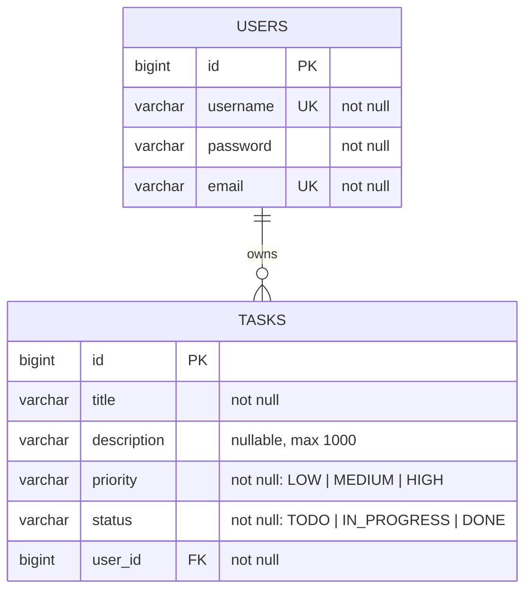

# Entity Relationship Diagram

```mermaid
erDiagram
    USERS ||--o{ TASKS : owns

    USERS {
        bigint id PK
        varchar username UK "not null"
        varchar password  "not null"
        varchar email UK "not null"
    }

    TASKS {
        bigint id PK
        varchar title "not null"
        varchar description "nullable, max 1000"
        varchar priority "not null: LOW | MEDIUM | HIGH"
        varchar status "not null: TODO | IN_PROGRESS | DONE"
        bigint user_id FK "not null"
    }
```